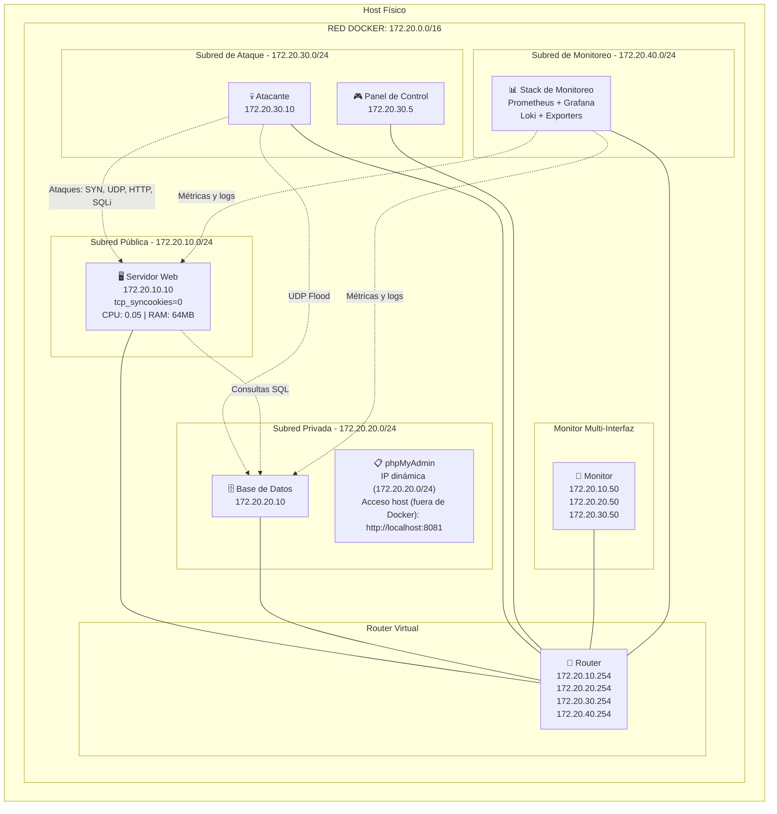

# Simulación de Red Empresarial con Docker

Proyecto final de redes orientado a demostrar, medir y explicar el impacto de ataques controlados sobre una infraestructura empresarial segmentada.

El proyecto implementa una simulación realista con una DMZ pública, una red privada, una red de ataque, un router virtual y un monitor multi-interfaz. Sobre esta base, se despliega una capa completa de observabilidad (Prometheus, Grafana, Loki y exporters) para visualizar en tiempo real el impacto de la denegación de servicio y las cargas maliciosas.

## Integrantes

- Santiago Reátegui
- María Emilia Cueva
- Jorge Gómez

---

## Topología de Red y Arquitectura

La topología base utiliza enrutamiento de Capa 3 a través de un router virtual, manteniendo las subredes aisladas sin usar NAT adicional. Esto permite observar las IPs reales de origen durante los ataques.



---

## Segmentación de Redes

1. **`red_publica` (172.20.10.0/24):** Aloja el `servidor_web` (EmpresaX). Es la red más visible durante `SYN Flood`, `UDP Flood` y `HTTP Flood`. Aquí se observa el impacto sobre la latencia HTTP, throughput, CPU del servidor web y conexiones `SYN_RECV`.
2. **`red_privada` (172.20.20.0/24):** Aloja la `base_datos`. Se ve afectada por el tráfico legítimo `web -> db` y por el `SQLi DoS`. Aquí se observa el impacto sobre conexiones MySQL y el ritmo de consultas.
3. **`red_ataque` (172.20.30.0/24):** Aloja al `atacante` y al `panel_control`. Desde aquí se originan los ataques, permitiendo correlacionar el tráfico emitido y los eventos del panel.
4. **`red_monitoreo` (172.20.40.0/24):** Aloja la capa de observabilidad. El `router` también está conectado a esta subred para dar coherencia topológica. *Importante:* El monitoreo funciona mediante exporters multi-interfaz con conectividad directa a las redes objetivo, por lo que el scraping de Prometheus no satura el plano de datos ruteado durante los ataques.

---

## Inventario de Ataques

Para hacer la presentación más clara y focalizada, el proyecto final se simplificó conservando exclusivamente los 4 ataques más representativos de distintas capas del modelo OSI (se eliminaron intencionalmente `ACK Flood` y `Conntrack Killer`).

| Ataque | Objetivo Principal | Red más Afectada | Evidencia Principal en Dashboards |
|---|---|---|---|
| **`SYN Flood`** | Pila TCP del servidor web | `red_publica` | Paquetes/s + `NET I/O` + `SYN_RECV` |
| **`UDP Flood`** | Ancho de banda y tráfico | `red_publica` | Paquetes/s + `NET I/O` |
| **`HTTP Flood`**| Procesamiento del servidor web (Capa 7) | `red_publica` | CPU web + Latencia HTTP + Throughput |
| **`SQLi DoS`** | Motor MySQL y Pool de Hilos | `red_privada` | Conexiones MySQL + Ritmo de consultas |

---

## Capa de Observabilidad y Monitoreo

El pipeline de monitoreo centraliza métricas y eventos sin interferir en el tráfico de los ataques:

* **Prometheus:** Colector central mediante scraping a endpoints `/metrics`.
* **Grafana:** Visualiza dashboards aprovisionados automáticamente.
* **Loki & Promtail:** Promtail recolecta los logs de los contenedores Docker y los envía a Loki para correlación temporal.
* **Blackbox Exporter:** Realiza probes activos (HTTP a EmpresaX, TCP a MySQL) para medir disponibilidad y latencia.
* **Apache Exporter:** Lee el `mod_status` del contenedor web (accesos, workers, scoreboard).
* **mysqld_exporter:** Expone metadatos, conexiones activas y contadores de tráfico del motor MySQL.
* **cAdvisor:** Aporta métricas base de contenedores en runtime.
* **docker_metrics_exporter:** Exporter propio que complementa a cAdvisor leyendo la API de Docker y ejecutando `ss -tan state syn-recv` en el web para exponer la métrica crítica `lab_container_tcp_syn_recv_connections`.

### Dashboards Finales en Grafana
1.  **`Red y Ataques`:** Resume ataques activos, paquetes por segundo y NET I/O.
2.  **`Servidor Web`:** CPU, porcentaje de RAM, latencia HTTP, throughput y conexiones `SYN_RECV`.
3.  **`Base de Datos`:** Disponibilidad MySQL, conexiones y consultas concurrentes.
4.  **`Logs del Proyecto`:** Correlaciona logs de acceso del servidor web y eventos del panel de control.

---

## Capturas de Tráfico para Wireshark

El proyecto permite generar capturas en formato `.pcap` o `.pcapng` para análisis forense en Wireshark. Las capturas se realizan directamente en el `router` (punto real de tránsito L3) usando automatizaciones que guardan los archivos en la carpeta persistente `analisis/pcaps/`.

**Ejemplos de captura manual:**
* **Linux:** `bash scripts/scripts_captura_ataques/linux/start_capture.sh red_publica syn`
* **Windows:** `scripts\scripts_captura_ataques\windows\start_capture.ps1 -Mode red_privada -Label sqli`
*(Para detener: usar `stop_capture.sh` o `stop_capture.ps1`)*

**Para generar capturas de demostración automatizadas (45 segundos por ataque):**
* **Linux:** `bash scripts/scripts_captura_ataques/linux/capture_all_attacks.sh 45`
* **Windows:** `scripts\scripts_captura_ataques\windows\capture_all_attacks.ps1 -DurationSeconds 45` o usando el `.bat`.

Un resumen de la ejecución quedará registrado en `analisis/pcaps/capturas_45s_resumen.txt`.

---

## Instrucciones de Uso Rápido

### En Linux
```bash
# Levantar infraestructura
bash scripts/scripts_captura_ataques/linux/up.sh

# Validar estado de los contenedores
bash scripts/scripts_captura_ataques/linux/validate.sh

# Lanzar ataques de prueba
bash scripts/scripts_captura_ataques/linux/attack.sh syn
bash scripts/scripts_captura_ataques/linux/attack.sh udp
bash scripts/scripts_captura_ataques/linux/attack.sh http
bash scripts/scripts_captura_ataques/linux/attack.sh sqli_dos

# Detener ataques
bash scripts/scripts_captura_ataques/linux/stop_attacks.sh
```

### En Windows (PowerShell)
```powershell
# Levantar infraestructura
scripts\scripts_captura_ataques\windows\up.ps1

# Validar estado de los contenedores
scripts\scripts_captura_ataques\windows\validate.ps1

# Lanzar ataques de prueba
scripts\scripts_captura_ataques\windows\attack.ps1 -Attack syn
scripts\scripts_captura_ataques\windows\attack.ps1 -Attack udp
scripts\scripts_captura_ataques\windows\attack.ps1 -Attack http
scripts\scripts_captura_ataques\windows\attack.ps1 -Attack sqli_dos

# Detener ataques
scripts\scripts_captura_ataques\windows\stop_attacks.ps1
```

---

## Documentación Principal

Para profundizar en áreas específicas del proyecto, consulta los siguientes documentos:

- [docs/arquitectura.md](docs/arquitectura.md)
- [docs/monitoreo.md](docs/monitoreo.md)
- [docs/capturas_wireshark.md](docs/capturas_wireshark.md)
- [docs/linux.md](docs/linux.md)
- [docs/windows.md](docs/windows.md)
- [docs/pruebas.md](docs/pruebas.md)
