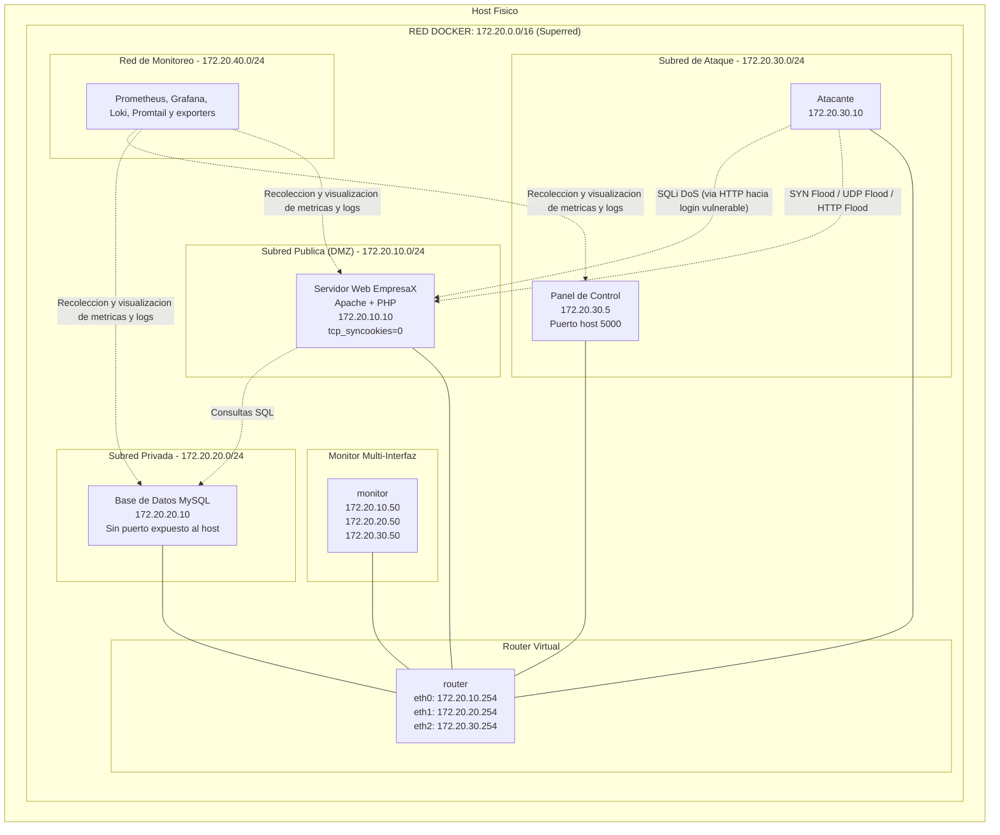

# Simulacion de Red Empresarial con Docker

Proyecto final de redes orientado a demostrar, medir y explicar el impacto de ataques controlados sobre una infraestructura empresarial segmentada. El proyecto conserva su topologia base con una DMZ publica, una red privada, una red de ataque, un router virtual y un monitor multi-interfaz. Sobre esa base se mantiene una capa de observabilidad con Prometheus, Grafana y Loki para apoyar la presentacion final.

## Integrantes

- Santiago Reategui
- Maria Emilia Cueva
- Jorge Gomez

## Estado final del proyecto

- Ataques disponibles: `SYN Flood`, `UDP Flood`, `HTTP Flood`, `SQLi DoS`
- Interfaces preservadas: `EmpresaX` y `Panel de Control DDoS y Explotacion`
- Dashboards finales:
  - `Red y Ataques`
  - `Servidor Web`
  - `Base de Datos`
  - `Logs del Laboratorio`

La simplificacion final redujo ataques y dashboards para hacer la presentacion mas clara, pero no modifico la infraestructura base ni la topologia logica del proyecto.

## Topologia de red



## Redes utilizadas y redes afectadas

### `red_publica` - `172.20.10.0/24`

- Aloja `servidor_web`.
- Es la red mas visible durante `SYN Flood`, `UDP Flood` y `HTTP Flood`.
- Aqui se observa el impacto sobre latencia HTTP, throughput, CPU del web, trafico y conexiones `SYN_RECV`.

### `red_privada` - `172.20.20.0/24`

- Aloja `base_datos`.
- Se ve afectada principalmente por el trafico legitimo `web -> db` y por el efecto indirecto o directo de `SQLi DoS`.
- Aqui se observa el impacto sobre conexiones MySQL y ritmo de consultas.

### `red_ataque` - `172.20.30.0/24`

- Aloja `atacante` y `panel_control`.
- Desde aqui se originan los cuatro ataques finales.
- Permite correlacionar ataques activos, volumen de trafico emitido y eventos del panel.

### `red_monitoreo` - `172.20.40.0/24`

- Aloja la capa de observabilidad.
- No reemplaza la topologia original; la complementa.
- Desde aqui `Prometheus` scrapea metricas y `Grafana` consulta `Prometheus` y `Loki`.

## Ataques finales y objetivo tecnico

| Ataque | Objetivo principal | Red mas afectada | Evidencia principal |
|---|---|---|---|
| `SYN Flood` | pila TCP del servidor web | `red_publica` | paquetes por segundo + `SYN_RECV` |
| `UDP Flood` | ancho de banda y trafico | `red_publica` | paquetes por segundo + `NET I/O` |
| `HTTP Flood` | procesamiento del servidor web | `red_publica` | CPU web + latencia + throughput |
| `SQLi DoS` | motor MySQL | `red_privada` | conexiones MySQL + ritmo de consultas |

## Monitoreo final

- `Red y Ataques`: resume ataques activos, paquetes por segundo y `NET I/O`.
- `Servidor Web`: muestra CPU, latencia HTTP, throughput y conexiones `SYN_RECV`.
- `Base de Datos`: muestra disponibilidad MySQL, conexiones y consultas.
- `Logs del Laboratorio`: correlaciona logs del web, MySQL y panel.

## Servicios principales

- `router`
- `servidor_web`
- `base_datos`
- `atacante`
- `monitor`
- `panel_control`
- `phpmyadmin`
- `prometheus`
- `grafana`
- `loki`
- `promtail`
- `blackbox_exporter`
- `apache_exporter`
- `mysqld_exporter`
- `cadvisor`
- `docker_metrics_exporter`

## Uso rapido

### Linux

```bash
bash scripts/linux/up.sh
bash scripts/linux/validate.sh
bash scripts/linux/attack.sh syn
bash scripts/linux/stop_attacks.sh
```

### Windows

```powershell
scripts\windows\up.ps1
scripts\windows\validate.ps1
scripts\windows\attack.ps1 -Attack syn
scripts\windows\stop_attacks.ps1
```

## Documentacion principal

- [README2_MONITOREO_CAMBIOS.md](<C:/Users/jgome/OneDrive/Escritorio/Redes/Proyecto_Redes/proyecto-redes-usfq/README2_MONITOREO_CAMBIOS.md>)
- [docs/arquitectura.md](<C:/Users/jgome/OneDrive/Escritorio/Redes/Proyecto_Redes/proyecto-redes-usfq/docs/arquitectura.md>)
- [docs/monitoreo.md](<C:/Users/jgome/OneDrive/Escritorio/Redes/Proyecto_Redes/proyecto-redes-usfq/docs/monitoreo.md>)
- [docs/linux.md](<C:/Users/jgome/OneDrive/Escritorio/Redes/Proyecto_Redes/proyecto-redes-usfq/docs/linux.md>)
- [docs/windows.md](<C:/Users/jgome/OneDrive/Escritorio/Redes/Proyecto_Redes/proyecto-redes-usfq/docs/windows.md>)
- [docs/pruebas.md](<C:/Users/jgome/OneDrive/Escritorio/Redes/Proyecto_Redes/proyecto-redes-usfq/docs/pruebas.md>)
