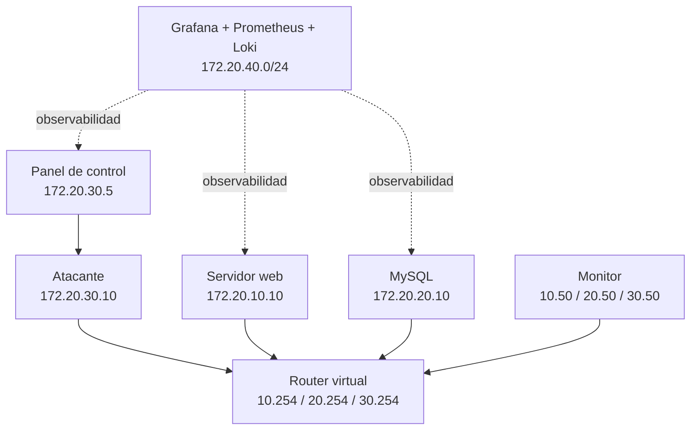

Red Empresarial con Docker, Ataques DDoS y Observabilidad

La infraestructura principal se mantiene con los mismos roles logicos del laboratorio:

- `servidor_web` en `172.20.10.10` dentro de la DMZ.
- `base_datos` en `172.20.20.10` dentro de la red privada.
- `atacante` en `172.20.30.10` dentro de la red de ataque.
- `router` como gateway virtual `.254` en las tres subredes originales.
- `monitor` conectado a las tres redes para observacion y captura.
- `panel_control` como interfaz de lanzamiento de ataques.
- `EmpresaX` como interfaz visual del servicio expuesto.

## Topologia conservada

Las redes academicas originales se preservan:

- `red_publica`: `172.20.10.0/24`
- `red_privada`: `172.20.20.0/24`
- `red_ataque`: `172.20.30.0/24`

La unica adicion estructural es `red_monitoreo` (`172.20.40.0/24`), usada exclusivamente para la capa de observabilidad. No reemplaza la topologia original ni altera el flujo de trafico del laboratorio.



## Ataques preservados

El laboratorio mantiene disponibles los seis ataques solicitados:

- `UDP Flood`
- `SYN Flood`
- `ACK Flood`
- `Conntrack Killer`
- `HTTP Flood`
- `SQLi DoS`

Todos se siguen lanzando desde el `panel_control` o desde scripts reproducibles en `scripts/linux` y `scripts/windows`.

## Stack de monitoreo

La observabilidad se implemento con:

- `Grafana`
- `Prometheus`
- `cAdvisor`
- `Blackbox Exporter`
- `mysqld_exporter`
- `apache_exporter`
- `Loki`
- `Promtail`
- `docker_metrics_exporter` propio para metricas de contenedores y red con mejor fidelidad en Docker Desktop/WSL

Dashboards provisionados automaticamente en Grafana:

- `Infraestructura General`
- `Servidor Web`
- `Base de Datos`
- `Red y Ataques`
- `Academico Explicativo`
- `Logs del Laboratorio`

## Inicio rapido

### Windows

```powershell
scripts\windows\up.ps1
scripts\windows\validate.ps1
```

### Linux

```bash
bash scripts/linux/up.sh
bash scripts/linux/validate.sh
```

## URLs utiles

- EmpresaX: [http://localhost:8080](http://localhost:8080)
- Panel DDoS: [http://localhost:5000](http://localhost:5000)
- Grafana: [http://localhost:3000](http://localhost:3000)
- Prometheus: [http://localhost:9090](http://localhost:9090)
- phpMyAdmin: [http://localhost:8081](http://localhost:8081)
- Loki ready: [http://localhost:3100/ready](http://localhost:3100/ready)

Credenciales iniciales de Grafana:

- Usuario: `admin`
- Clave: `admin`

## Scripts principales

- Levantar entorno: `scripts/windows/up.ps1` o `scripts/linux/up.sh`
- Validar entorno: `scripts/windows/validate.ps1` o `scripts/linux/validate.sh`
- Generar trafico legitimo: `scripts/windows/generate_legitimate_traffic.ps1` o `scripts/linux/generate_legitimate_traffic.sh`
- Lanzar ataques: `scripts/windows/attack.ps1 -Attack <ataque>` o `scripts/linux/attack.sh <ataque>`
- Detener ataques: `scripts/windows/stop_attacks.ps1` o `scripts/linux/stop_attacks.sh`
- Reiniciar laboratorio: `scripts/windows/reset_lab.ps1` o `scripts/linux/reset_lab.sh`
- Consultar logs: `scripts/windows/logs.ps1` o `scripts/linux/logs.sh`
- Consultar metricas: `scripts/windows/metrics.ps1` o `scripts/linux/metrics.sh`

## Documentacion

- [README2_MONITOREO_CAMBIOS.md](README2_MONITOREO_CAMBIOS.md)
- [docs/arquitectura.md](docs/arquitectura.md)
- [docs/monitoreo.md](docs/monitoreo.md)
- [docs/linux.md](docs/linux.md)
- [docs/windows.md](docs/windows.md)
- [docs/pruebas.md](docs/pruebas.md)

## Nota sobre interfaces preservadas

Las vistas `EmpresaX` y `Panel de Control DDoS y Explotacion` se conservaron sin redisenos. La capa de monitoreo se incorporo como complemento externo en Grafana, no como sustitucion de las interfaces originales del laboratorio.
